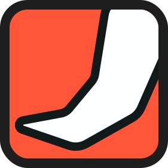

# IvoryTusk

> This is a simple base project to try use multiple projects with different versions of PHP.
> The original idea is could be create an alternative of Laragon for Linux.

## Dependencies

- Container Manager (Docker or Podman)
- Bash (To execute some scripts)

- [gum](https://github.com/charmbracelet/gum)
